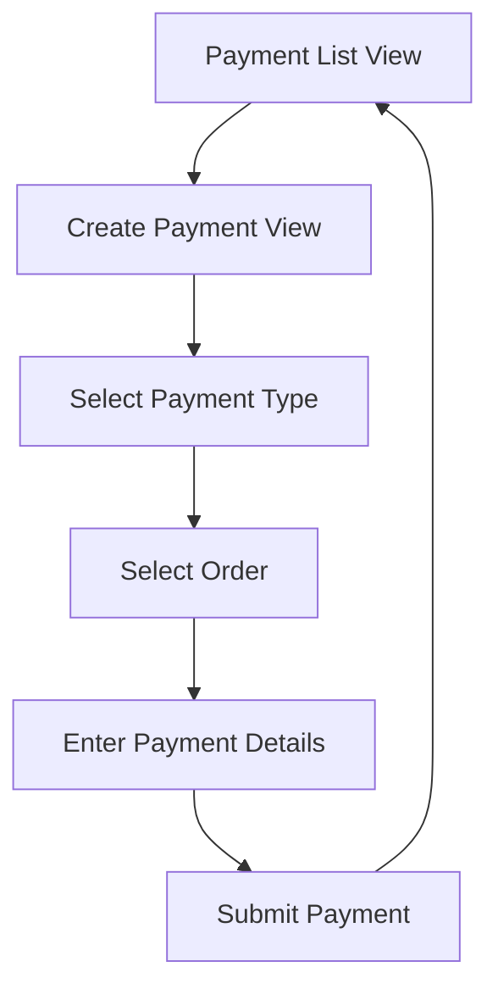

# Payments Management System Requirements

## 1. Product Overview
A comprehensive payment management system that allows users to record, track, and manage payments for orders. The system supports both direct payments and salesman-collected payments with various payment methods and detailed tracking capabilities.

## 2. Core Features

### 2.1 User Roles
| Role | Registration Method | Core Permissions |
|------|---------------------|------------------|
| Admin | System assigned | Full access to all payment operations, view all payments |
| Salesman | Admin invitation | Record payments for their orders, view their payment history |
| Manager | Admin upgrade | View all payments, generate payment reports |

### 2.2 Feature Module
Our payments management system consists of the following main pages:
1. **Payment List View**: payment table, filtering options, record payment button.
2. **Create Payment View**: order selection, payment details form, payment method specific fields.

### 2.3 Page Details
| Page Name | Module Name | Feature description |
|-----------|-------------|---------------------|
| Payment List View | Payment Table | Display all payments with order_number, amount_received, payment_method, status, created_at columns |
| Payment List View | Filter Controls | Filter by payment_method, status, and salesman with dropdown selectors |
| Payment List View | Action Buttons | "Record Payment" button to navigate to create payment view |
| Create Payment View | Payment Type Selection | Choose between direct payment or salesman-collected payment |
| Create Payment View | Order Selection | Searchable dropdown to select an existing order for payment |
| Create Payment View | Payment Details Form | Input fields for amount_received, payment_method, notes, transaction_reference |
| Create Payment View | Conditional Fields | Additional fields (bank_name, cheque_date) based on selected payment_method |
| Create Payment View | Submit Action | "Add Payment" button to save payment record |

## 3. Core Process

### Payment Recording Flow
1. User navigates to Payment List View to see all existing payments
2. User clicks "Record Payment" to open Create Payment View
3. User selects payment type (Direct or Salesman-collected)
4. User searches and selects the order for which payment is being recorded
5. User enters payment details including amount, method, and notes
6. System shows additional fields based on payment method (e.g., bank details for cheque)
7. User submits the payment record
8. System validates and saves the payment to database
9. User returns to Payment List View with updated payment list

## 4. User Interface Design

### 4.1 Design Style
- Primary colors: Blue (#3B82F6) for actions, Green (#10B981) for success states
- Secondary colors: Gray (#6B7280) for text, Red (#EF4444) for errors
- Button style: Rounded corners with subtle shadows
- Font: Inter or system default, 14px base size
- Layout style: Clean table-based design with card layouts for forms
- Icons: Heroicons or similar modern icon set

### 4.2 Page Design Overview
| Page Name | Module Name | UI Elements |
|-----------|-------------|-------------|
| Payment List View | Payment Table | Responsive table with striped rows, sortable columns, pagination |
| Payment List View | Filter Controls | Horizontal filter bar with dropdown selectors and search input |
| Create Payment View | Payment Form | Two-column form layout with grouped fields and conditional sections |
| Create Payment View | Order Selection | Autocomplete dropdown with order number and customer name display |

### 4.3 Responsiveness
Desktop-first design with mobile-adaptive layouts. Touch-optimized buttons and form controls for mobile devices. Tables collapse to card layouts on smaller screens.