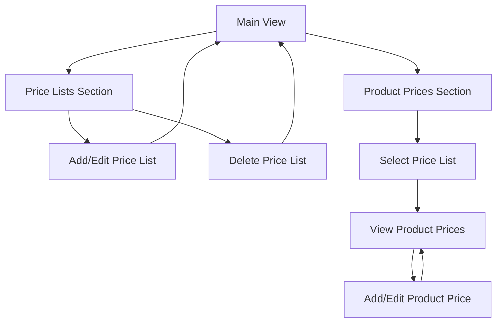

# Product Prices & Price Lists Management System Requirements

## 1. Product Overview

A comprehensive price management system that allows users to create and manage multiple price lists for products, enabling flexible pricing strategies for different customer segments. The system provides dual functionality for managing price lists and setting product-specific prices within each list.

## 2. Core Features

### 2.1 User Roles

| Role     | Registration Method | Core Permissions                                                                    |
| -------- | ------------------- | ----------------------------------------------------------------------------------- |
| Admin    | System assigned     | Full access to all price list operations, create/edit/delete price lists and prices |
| Manager  | Admin upgrade       | View all price lists, edit product prices, create new price lists                   |
| Salesman | Admin invitation    | View assigned price lists, cannot modify prices                                     |

### 2.2 Feature Module

Our price lists management system consists of the following main sections:

1. **Price Lists Section**: price list table, add/edit/delete price lists, price list management.
2. **Product Prices Section**: price list selection, product price table, add/edit product prices.

### 2.3 Page Details

| Page Name          | Module Name             | Feature description                                                                   |
| ------------------ | ----------------------- | ------------------------------------------------------------------------------------- |
| Main View          | Price Lists Table       | Display all price lists with name and description columns                             |
| Main View          | Price List Actions      | "Add New Price List" button, Edit and Delete buttons for each price list              |
| Main View          | Price List Form Modal   | Modal form with name and description fields for creating/editing price lists          |
| Main View          | Product Prices Dropdown | Dropdown selector to choose a specific price list                                     |
| Main View          | Product Prices Table    | Display products and their prices for selected price list (product\_name, sku, price) |
| Main View          | Product Price Actions   | "Add Product Price" and "Edit Prices" buttons for managing product prices             |
| Product Price Form | Product Search          | Searchable dropdown to select products for price assignment                           |
| Product Price Form | Price Input             | Input field for setting product price in selected price list                          |
| Product Price Form | Bulk Edit               | Interface for editing multiple product prices simultaneously                          |

## 3. Core Process

### Price List Management Flow

1. User views the main page with two sections: Price Lists and Product Prices
2. User can create new price lists using "Add New Price List" button
3. User can edit or delete existing price lists using action buttons
4. User selects a price list from dropdown in Product Prices section
5. System displays all products and their prices for the selected price list
6. User can add new product prices or edit existing ones
7. System prevents duplicate entries with unique constraint on (price\_list\_id, product\_id)

### Product Price Management Flow

1. User selects a price list from the dropdown
2. System loads and displays all products with their prices for that list
3. User clicks "Add Product Price" to assign prices to new products
4. User searches for products and sets their prices
5. User can bulk edit multiple product prices
6. System validates and saves price changes
7. Updated prices are immediately reflected in the table

## 4. User Interface Design

### 4.1 Design Style

* Primary colors: Blue (#3B82F6) for actions, Green (#10B981) for success states

* Secondary colors: Gray (#6B7280) for text, Orange (#F59E0B) for warnings

* Button style: Rounded corners with hover effects and subtle shadows

* Font: Inter or system default, 14px base size

* Layout style: Split-screen design with clear section separation

* Icons: Heroicons with consistent sizing and styling

### 4.2 Page Design Overview

| Page Name          | Module Name            | UI Elements                                                     |
| ------------------ | ---------------------- | --------------------------------------------------------------- |
| Main View          | Price Lists Section    | Clean table with action buttons, modal overlay for forms        |
| Main View          | Product Prices Section | Dropdown selector with table below, responsive grid layout      |
| Price List Modal   | Form Fields            | Centered modal with form validation and error states            |
| Product Price Form | Search Interface       | Autocomplete with product images and details preview            |
| Product Price Form | Bulk Edit Table        | Editable table with inline editing and batch save functionality |

### 4.3 Responsiveness

Desktop-first approach with mobile-adaptive layouts. Split sections stack vertically on mobile devices. Tables transform to card layouts with swipe actions for mobile interaction. Modal forms adjust to screen size with touch-optimized controls.

## 5. Data Flow Specifications

### Price Lists Data Operations

* **View**: `SELECT * FROM price_lists ORDER BY name`

* **Create**: `INSERT INTO price_lists (name, description) VALUES (?, ?)`

* **Update**: `UPDATE price_lists SET name = ?, description = ? WHERE id = ?`

* **Delete**: `DELETE FROM price_lists WHERE id = ?`

### Product Prices Data Operations

* **View**: `SELECT pp.*, p.name, p.sku FROM product_prices pp JOIN products p ON pp.product_id = p.id WHERE pp.price_list_id = ?`

* **Create**: `INSERT INTO product_prices (price_list_id, product_id, price) VALUES (?, ?, ?)`

* **Update**: `UPDATE product_prices SET price = ? WHERE price_list_id = ? AND product_id = ?`

* **Constraint**: UNIQUE constraint on (price\_list\_id, product\_id) prevents duplicate entries

